# Car Store Database in an AWS EC2 instance:

### Technologies:

1. Nodejs
2. MongoDB
3. Bash
4. AWS

Note: This post is for people who doesn't have knowledge of Node.js so I explained every possible concept. Future posts won't have explanation of concepts already explained here. **Future posts will contain security measures in AWS for better understanding of the current process and not overfeeding the post.**

### Source code structure:

1. `Index.js`: Main entry point of the Node.js application. It sets up the server and initializes middleware, routes, and database connections.
2. `models/product.models.js`: Defines the product structure (schema) of the data (name, price, etc).
3. `routes/product.route.js`: Defines the API endpoints (routes). `Routes` define the URLs/endpoints that your application responds to and what happens when a user visits them. 
4. `controllers/roduct.controller.js`: Handles the business logic for each route, such as fetching products, creating a new product, or deleting a product. `Controllers` separate the application logic reducing clutter in the routes.

### Node.js installation (locally) on Ubuntu:

Node.js is a JavasScript rntime environment that allows to run JavaScript code outside of browsers. It is often used to build backend servers and APIs because it is fast, lightweight and event driven. It is also well-suited for applications that require handling multiple simultaneous requests like web servers.
In software development, separating code into different files and folders is a best practice known as modularization. It facilitates code organization (separating logic into different files like routes, controllers and models), reusability (each model can be used accross the project without duplicating code), team collaboration (different team members can work on specific parts of the project without conflict) and scalability (well structured projects are easier to extend).

1. Download Nodejs from [here](https://nodejs.org/en)
2. Go where the compressed file is located and do: `tar -xf node-v%(version)s-%(arch)s.tar.xz`
3. Move the content of the uncompressed file to: `sudo mv node-v%(version)s-%(arch)s /usr/local/node`
4. Add Node.js to your $PATH:
```
echo 'export PATH=/usr/local/node/bin:$PATH' >> ~/.bashrc
source ~/.bashrc
```
5. Verify your installation:
```
node -v
npm -v
```
6. For git CLI access run: `sudo apt-get install git`

### Development of a CRU database with Node.js:

1. Initialize a new Node.js project: `npm init -y`
2. Install mongoose, mongodb, express and nodemon: `npm install mongoose mongodb express nodemon -D`.
3. To connect a MongoDB database to our Node.js backend an account is required.
4. To connect to the MongoDB database run:
```
mongodb+srv://<username>:<db_password>@cluster0.emyfy.mongodb.net/?retryWrites=true&w=majority&appName=Cluster0
```


## AWS

Set an EC2 instance in AWS. Set as image Ubuntu's most recent version, x86_64 architecture, free tier eligible instance type.
To access the instance through ssh a key pair (login) is needed. For that, create your key pair and download it (Key pair type RSA and file format .pem). For network settings allow SSH traffic from `My IP`, HTTPS and HTTP traffic from the internet. Launch instance.

1. After downloading the key pair, find it in your Downloads folder: `ls -la | grep pem`
2. Grab the name and move it to: `mv CRU-Database-Nodejs.pem ~/.ssh`
3. Move to: `cd ~/.ssh`
4. Activate permissions: `chmod 400 "CRU-Database-Nodejs.pem"`
5. Connect to the AWS instance by: `ssh -i "./CRU-Database-Nodejs.pem" ubuntu@ec2-<IP>.eu-north-1.compute.amazonaws.com`

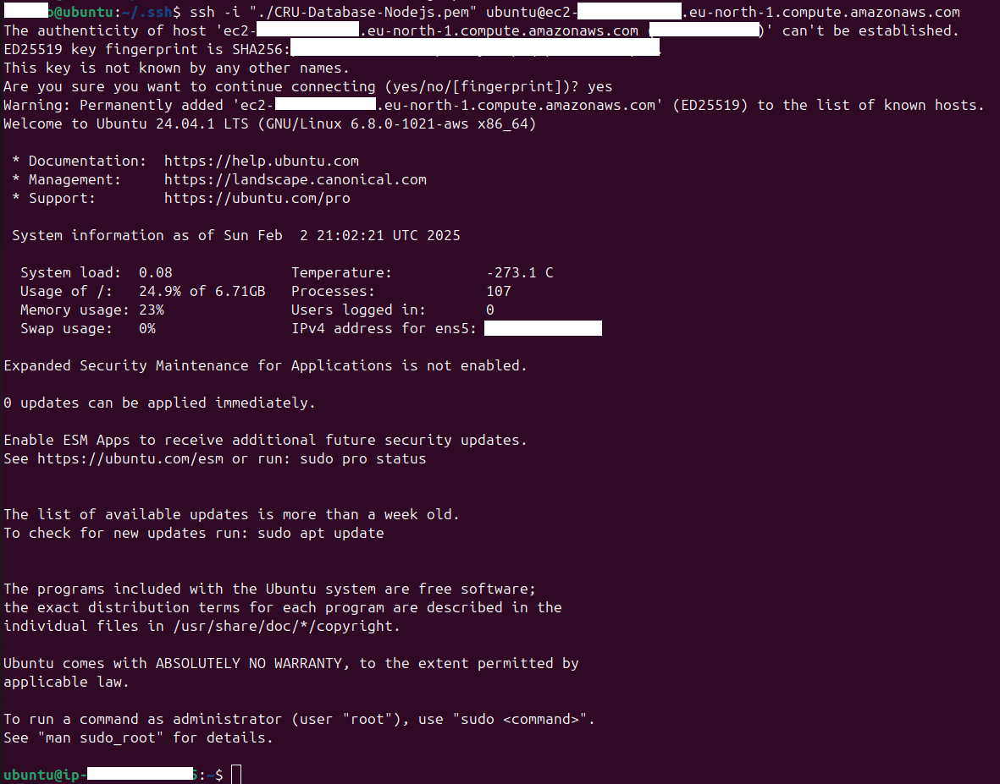

6. Run the following command to update the OS: `sudo apt update && sudo apt upgrade`
7. Download and execute the NodeSource setup script to configure the repository and install nodejs.

```
curl -fsSL https://deb.nodesource.com/setup_20.x | sudo -E bash - && sudo apt-get install -y nodejs
```

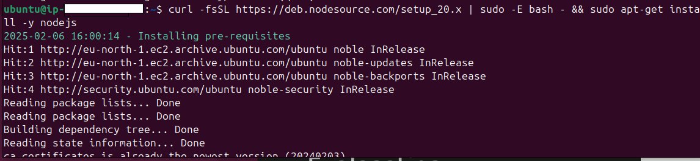

8. After Nodejs is installed, open a new terminal locally where the Nodejs project is downloaded, run the following code:

```
rsync -avz --exclude 'node_modules' --exclude '.git' --excllude 'POST_nodejs.sh' --exclude '.env' \
-e "ssh -i ~/.ssh/CRU-Database-Nodejs.pem" \
. ubuntu@<INSTANCE_ADDRESS>:~/app
```

This command is better than just copying (scp) the files from the local path to the AWS instance, it sincronizes the files. Only copies the files that were changed or not existant.

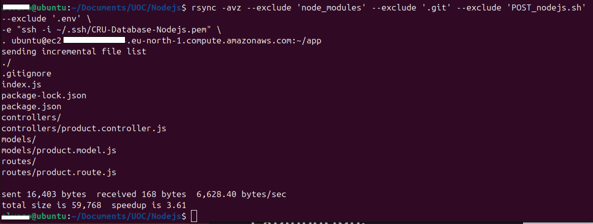

Return to your AWS ssh connection and check for the files:

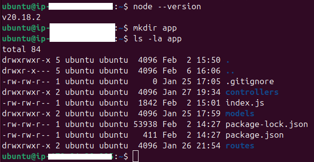

Now that you have all the files, install all the libraries. Move to `~/app` and run: `npm install`. Run the server by `npm run serve`

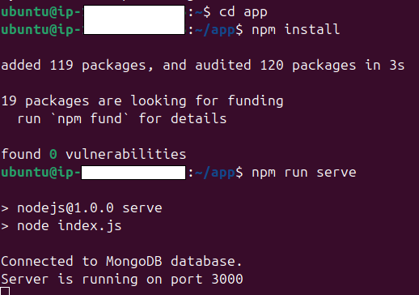

Before connecting through the Browser to check the content of the MongoDB database inbound connections must be allowed. For that enter: EC2/Security Groups/WebServerDatabase (Security Group Name)/Entry Rules (Edit entry rules).
Here traffic through port 3000 is needed. So  allow traffic through this port from your IP:

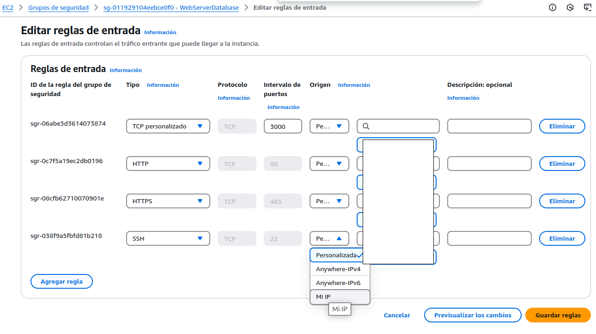

After the inbound rule is edited. Access the EC2 instance, networks, and find the public IPv4  open the browser and type: `<Public_IPv4:3000/api/products`.

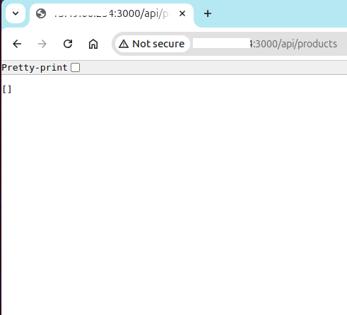

Congratulations! You got access to the MongoDB database through AWS!

### Playing with the Database (example: Car store database)

A bash script was created to play with the database. For that locally execute it. You can create, show (one or all), update or delete items.

1. Create items: Create two cars in the database (you have 2 cars)

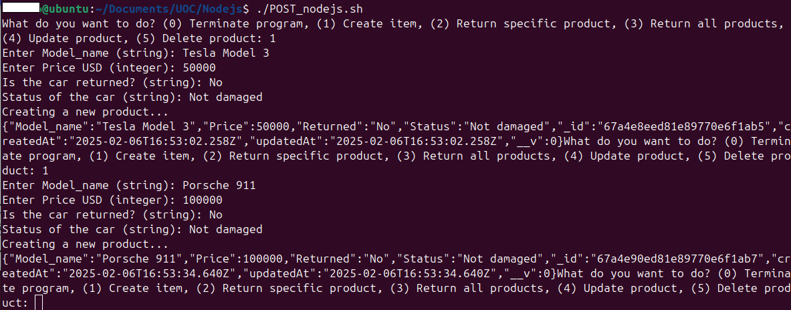
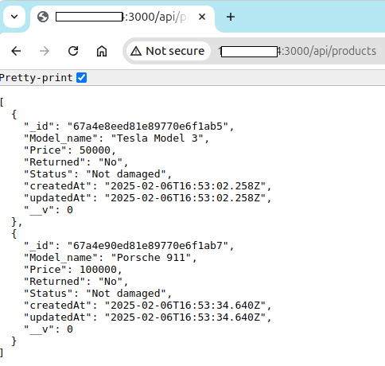

2. Update product: Update the Tesla Model 3 (it got returned fur to some damage)

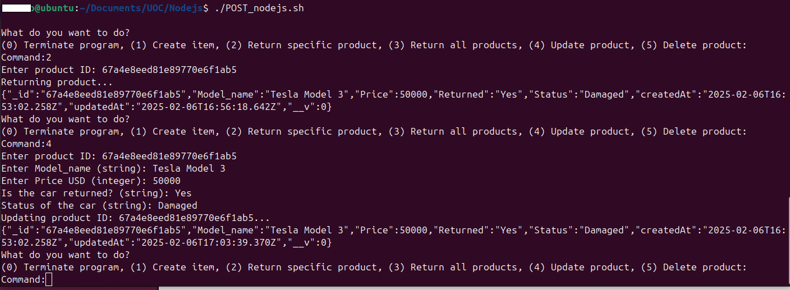
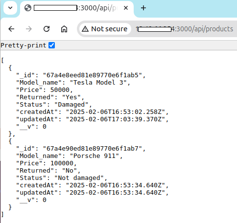

3. Delete product: You don't have Tesla Model 3 anymore

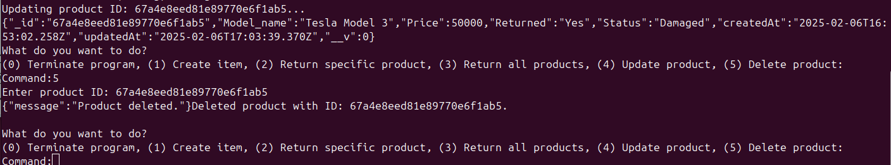
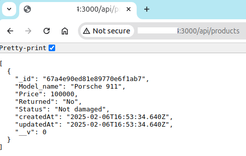

Congratulations! 🥳 You played with a MongoDB in an AWS instance 😃👍🏽
