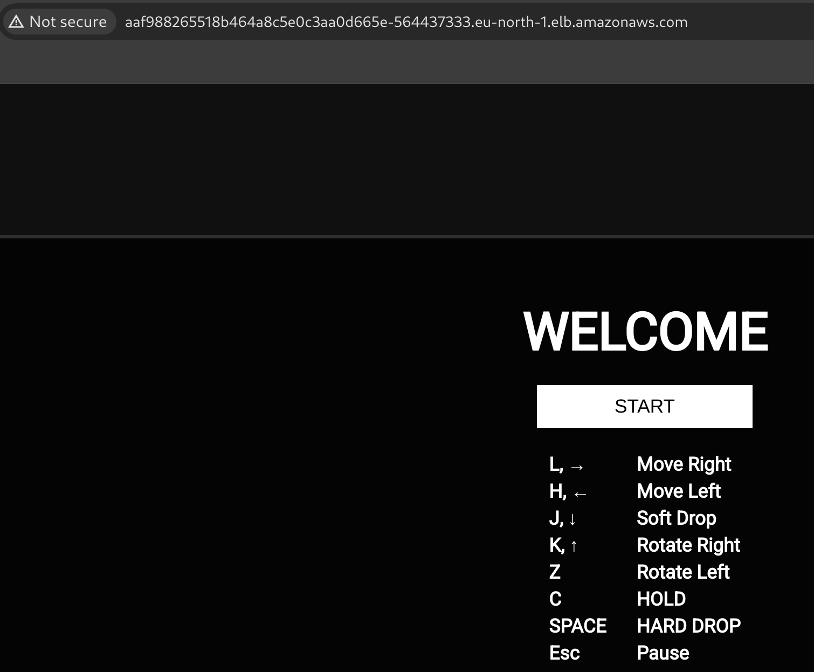
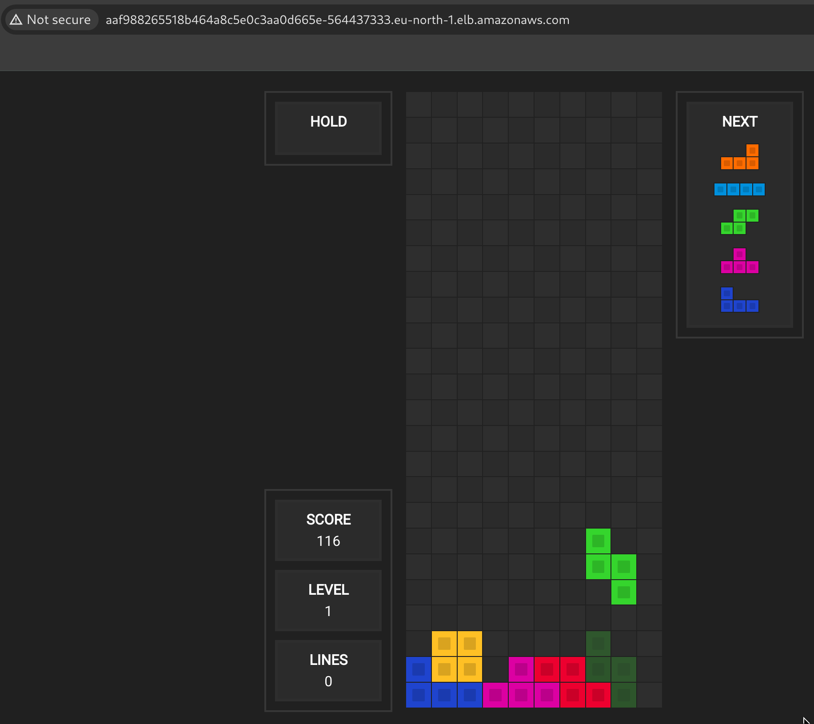

# Secure CI/CD pipeline for containerized Tetris Delivery on AWS
#### (Post explanation under development)
##### Project result:

<p align="center">
  
  
  
</p>


# Index:

1. Setting up servers
2. CI/CD
3. Playing Tetris

# Setting up servers

## Jenkins server

Activate the `jenkins-server` EC2 instance.
Locate your `.pem` file and enable permissions: `chmod 400 <KEYPAIR_FILENAME>`
Connect to your instance: `ssh -i <KEYPAIR_FILENAME> ubuntu@ec2-<PUBLIC_IP>.eu-north-1.compute.amazonaws.com`

(pic2)

You are connected to your jenkins-server!
For Jenkins installation I used the following [tutorial post](https://www.digitalocean.com/community/tutorials/how-to-install-jenkins-on-ubuntu-20-04).

1. Activate root user: `sudo su`
2.  Add the Correct GPG Key: 
```
sudo mkdir -p /etc/apt/keyrings
curl -fsSL https://pkg.jenkins.io/debian-stable/jenkins.io-2023.key | sudo tee /etc/apt/keyrings/jenkins-keyring.asc > /dev/null
```
3. Add the Jenkins repository to the system's package sources list: `echo "deb [signed-by=/etc/apt/keyrings/jenkins-keyring.asc] https://pkg.jenkins.io/debian-stable binary/" | sudo tee /etc/apt/sources.list.d/jenkins.list > /dev/null`
4. Update and upgrade the package list: `apt update && apt upgrade`
5. Install Jenkins: `apt install jenkins`
6. Start Jenkins service: `systemctl start jenkins`
7. After installing Jenkins it is probable that it won't work. In my case it was due to missing java (`java --version`). To solve this issue, install Java too: `apt install -y openjdk-17-jdk`. Repeat step 6.
8. Check Jenkins service status*: `systemctl status jenkins`

(pic3)

*`systemctl` is a tool used to manage system services on Linux systems that use systemd. `systemd` is a service manager for Linux, used to boot the system and managing processes.

9. Check if the firewall is inactive: `ufw status`
10. Allow traffic on port 8080 through firewall: `ufw allow 8080`
11. Check if the firewall is inactive: `ufw status`
12. If firewall is inactive (Means all firewall rules were ignored, including the ufw allow 8080 rule), allow OpenSSH and enable it: `sudo ufw allow OpenSSH && ufw enable`

(pic4)

When previous command is run, the `ufw enable` command activated the firewall, making all previously added rules (including 8080) take effect.
13. Check if the firewall is inactive again: `ufw status`.
14. Get the initial Jenkins admin password: `cat /var/lib/jenkins/secrets/initialAdminPassword`

(pic5)

Once you get the password, access the browser, type `<PUBLIC_IP_JENKINS>:<PORT>` and introduce it.

(pic6)

1. Select `Install suggested plugins`.
2. Create first admin user.
3. Save your Jenkins instance configuration: `http://<PUBLIC_IP_JENKINS>:<PORT>/`

(pic7)

Search and install: Dashboard -> Manage Jenkins -> Plugins -> ssh agent

(pic8)

Restart Jenkins after installation is fulfilled.

(pic9)

Jenkins ready!

### Setting persistance on Jenkins

When you turn off your EC2 instance, you will loose access to your Jenkins pipeline, being too slow to be used. It will seem like there are some issues to troubleshoot with Network ACLs, Security groups, Firewalls... Nonetheless, if you followed the exact same process from this post, you have to enable a recurrent update of your last update. For that:

1. Run: `vim /opt/update-jenkins-url.sh` and copy the content of the file `update-jenkins-url.sh` in the repository. Save and exit.
2. Execute `chmod +x /opt/update-jenkins-url.sh`.
3. Run: `sudo vim /opt/startup-tasks.sh`
4. This file will be the main "startup-tasks" that will be executed each time the EC2 instance is started/rebooted. Add:
```
#!/bin/bash

/opt/update-jenkins-url.sh
# Any other script you may need
```
3. Run: `sudo chmod +x /opt/startup-tasks.sh`
4. Run: `sudo vim /etc/systemd/system/startup-tasks.service`
```
[Unit]
Description=Run all custom startup scripts after boot
# The service starts after the network is up
After=network.target

[Service]
# Oneshot: Run the service once and then exit (don't stay active)
Type=oneshot

ExecStart=/opt/startup-tasks.sh

[Install]
# Run automatically while booting
WantedBy=multi-user.target
```
5. Activate the service again: `sudo systemctl daemon-reload && sudo systemctl enable startup-tasks.service`

## Ansible server

(Install Ansible both in Ansible and Kubernetes Server)

Ansible is an open-source automation tool used for configuration management, application deployment, and infrastructure orchestration. It allows managing servers and deployments using YAML-based playbooks. In this example, it will execute tasks on a remote server (the Kubernetes node). Instead of manually logging into the Kubernetes server and running kubectl apply or configurations, Ansible automates this process from a central control node (the "Ansible server"). This is typical in environments where infrastructure as code (IaC) and centralized management are required.

For Ansible server set as:

1. Inbound connections: HTTP/HTTPS Anywhere IPv4 (Description: Internet connection -> EC2), SSH Jenkins IP, My IP (Jenkins, My IP connection)
2. Outbound connections: HTTP/HTTPS Anywhere IPv4 (Description: EC2 -> Internet connection)

For Ansible installation I used the following [tutorial post](https://www.digitalocean.com/community/tutorials/how-to-install-and-configure-ansible-on-ubuntu-20-04).
1. Activate root user: `sudo su`
2. Add the Ansible PPA repository: `apt-add-repository ppa:ansible/ansible`
3. Update package lists to include the new repository and upgrade: `apt update && apt upgrade`
4. Install Ansible: `apt install ansible`

## Kubernetes server

Kubernetes (K8s) is an open-source container orchestration platform used for automating deployment, scaling, and management of containerized applications across multiple nodes. For this section we will install Docker and Kubectl.

### Docker (Install both in Ansible and Kubernetes server)

Docker is an open-source containerization platform that allows developers to package applications and their dependencies into lightweight, portable containers. For Docker installation I used the following [tutorial post](https://www.digitalocean.com/community/tutorials/how-to-install-and-use-docker-on-ubuntu-20-04).

1. Activate root user: `sudo su`
2. Update package lists: `apt update`
3. Install required dependencies for Docker: `apt install apt-transport-https ca-certificates curl software-properties-common`
4. Add the Docker GPG key to verify package authenticity: `curl -fsSL https://download.docker.com/linux/ubuntu/gpg | sudo apt-key add -`

      i. `-fsSL` : Ensures a silent, fail-safe, and secure download.

      ii. `apt-key add -` : Adds the downloaded GPG key to verify Docker packages.

5. Add the official Docker repository to APT sources: `add-apt-repository "deb [arch=amd64] https://download.docker.com/linux/ubuntu focal stable"`
6. Check available Docker versions and repository priority: `apt-cache policy docker-ce`
7. Install Docker CE (Community Edition): `apt install docker-ce`
8. Exit root mode and add your user to the docker group: `sudo usermod -aG docker $USER`
9. Check Docker service status: `systemctl status docker`

(pic10)

### Minikube (Install both in Ansible and Kubernetes server)

Minikube is a lightweight Kubernetes tool that runs a single-node Kubernetes cluster locally on your machine. It is mainly used for development, testing, and learning Kubernetes without needing a full multi-node setup. For Minikube installation I used the following [tutorial post](https://www.digitalocean.com/community/tutorials/how-to-use-minikube-for-local-kubernetes-development-and-testing)

1. Activate root user: `sudo su`
2. Download and install Minikube binary for Ubuntu: `curl -LO https://storage.googleapis.com/minikube/releases/latest/minikube-linux-amd64`
3. Move the Minikube binary to `/usr/local/bin/` and make it executable: `install minikube-linux-amd64 /usr/local/bin/minikube`
4. Start Minikube with a compatible driver (using Docker): `minikube start --driver=docker`
5. Check all running pods in all namespaces: `kubectl get pods -A`

If kubectl is not recognised:

#### kubectl

kubectl is the command-line tool for interacting with Kubernetes clusters. It allows you to deploy applications, inspect resources, manage cluster components, and troubleshoot issues.

1. Update package lists and install transport support for HTTPS repositories: `apt-get update && apt-get install -y apt-transport-https`
3. Add Kubernetes GPG Key:
```
mkdir -p /etc/apt/keyrings
curl -fsSL https://pkgs.k8s.io/core:/stable:/v1.29/deb/Release.key | tee /etc/apt/keyrings/kubernetes-apt-keyring.asc > /dev/null
```
4. Add Kubernetes Repository: `echo "deb [signed-by=/etc/apt/keyrings/kubernetes-apt-keyring.asc] https://pkgs.k8s.io/core:/stable:/v1.29/deb/ /" | tee /etc/apt/sources.list.d/kubernetes.list`
5. Update and Install kubectl:
```
sudo apt update
sudo apt install -y kubectl
```
6. Exit root mode: `exit`
7. Verify kubectl Installation: `kubectl version --client`
8. Add your user to the Docker group: `sudo usermod -aG docker $USER`
9. Apply the new group permissions: newgrp docker
10. Start Minikube: `minikube start --driver=docker`
11. Check if Kubernetes is working: `kubectl get pods -A`

(pic11)

# CI/CD

## Github webhooks

GitHub Webhooks are automated HTTP callbacks that notify an external service (e.g. Jenkins, Slack, or a custom API) whenever specific events happen in a GitHub repository. It can be used to trigger CI/CD pipelines (our situation), send notifications or automate workflows.
To set it up, go to Jenkins Dashboard -> New Item (Name: jenkins-pipeline) -> For script introduce:

```
node {
    stage('Git checkout'){
        git 'https://github.com/3v401/DevOps.git'
    }
}
```

Save.

Now access to Github repository (DevOps) -> Settings -> Webhooks -> Add new Webhook:

1. Payload URL: http://<JENKINS_IP>:<PORT>/github-webhook/
2. Content type: application/json
3. Secret: To introduce the secret go to the jenkins-server and Dashboard -> Your user -> Security -> Add new token. Save the token and paste it into the Secret section.

(pic12)

4. Click on: Update webhook

(pic13)

Refresh the page after ping is sent. If it doesn't work (error appears). Very likely it is because the Jenkins server doesn't allow inbound access from Github webhooks. For that:

Open new terminal and run: `curl -s https://api.github.com/meta | jq -r '.hooks[]'`

(pic14)

This way you will get the list of IP addresses from GitHub to allow inbound rules.

(pic15)

Go to Webhooks (the one with error) -> Edit -> Recent Deliveries -> Redelivery. You will get the ping correctly.
Open the Dockerfile in our project and add a new port (e.g., 22). Save, commit and push. You will observe in the Jenkins Dashboard the following:

(pic16) show Jenkins dashboard of the updated version with the webhook

## Jenkins connection to Ansible

Set Global (unrestricted) credentials:

Access to: Dashboard -> Manage Jenkins -> Credentials -> System -> Global credentials (unrestricted) -> Add credentials

Kind: SSH Username with private key, Scope: Global, ID: ansible_demo, Description: ansible_demo, Username: <ANSIBLE_USERNAME>, Private Key: Enter directly (enter your private key from your pem file).

Once finished, you will get the following credentials list:

(pic16)

Now access to a created `jenkins-pipeline` via: Dashboard -> jenkins-pipeline -> Pipeline Syntax. Sample Step: sshagent: SSH Agent, select 'ubuntu (ansible_demo)', then select 'Generate Pipeline Script'. It will return:
```
sshagent(['ansible_demo']) {
    // some block
}
```

Save this snippet in a txt file.

### Communication Jenkins <-> Ansible

To allow communication to Ansible, access: Ansible EC2 -> Security Groups -> Edit Inbound rules:
1.  All traffic, source "My IP", Description: My IP traffic
2.  SSH, source "Jenkins IP", Description: SSH connection Jenkins - Ansible.

### Sending content from Jenkins to Ansible

After establishing the connection, generate the following pipeline content:

```
node {
    stage('Git checkout'){
        git 'https://github.com/3v401/DevOps.git'
    }
    stage('Sending Jenkins content to Ansible server over ssh'){
        sshagent(['ansible_demo']){
            sh 'ssh -o StrictHostKeyChecking=no <ANSIBLE_USERNAME>@<ANSIBLE_PUBLIC_IP>'
            sh 'scp /var/lib/jenkins/workspace/jenkins-pipeline/Tetris-Game/* <ANSIBLE_USERNAME>@<ANSIBLE_PUBLIC_IP>:/home/<ANSIBLE_USERNAME>'
        }
    }
}
```

Click on apply, save and click on `build now`. Wait until you get feedback. You will get the following outcome:

(pic17)

Jenkins prompts that the content has been sent correctly from Jenkins to Ansible. To check everything is setup, let's access the ansible terminal and verify its content:

(pic18)

As expected, the content is also located in the Ansible server.


### Communication Ansible <-> DockerHub

#### Building

In the Jenkins pipeline add the following snippet:

```
stage('Docker build image'){
    sshagent(['ansible_demo'])}
        sh 'ssh -o StrictHostKeyChecking=no <ANSIBLE_USERNAME>@<ANSIBLE_PUBLIC_IP> cd /home/<ANSIBLE_USERNAME>/'
        sh 'ssh -o StrictHostKeyChecking=no <ANSIBLE_USERNAME>@<ANSIBLE_PUBLIC_IP> docker imge build -t $JOB_NAME:v1.$BUILD_ID .'
    }
}
```

1. Connect to your Jenkins server, check the files: `ls -la /var/lib/jenkins/workspace/jenkins-pipeline`
2. Connect to your Ansible server, check the files: `ls -la ~`
3. In your Ansible server run: `sudo docker image ls`

(pic19)

Congratulations, your Docker image has been built!

#### Tagging

Now let's tag it for later pushing it to the DockerHub. Add the following snippet to the previous jenkins-pipeline:

```
stage('Docker image tagging'){
    sshagent(['ansible_demo']){
        sh 'ssh -o StrictHostKeyChecking=no <ANSIBLE_USERNAME>@<ANSIBLE_PUBLIC_IP> cd /home/<USERNAME>/'
        sh 'ssh -o StrictHostKeyChecking=no <ANSIBLE_USERNAME>@<ANSIBLE_PUBLIC_IP> docker image tag $JOB_NAME:v1.$BUILD_ID <DOCKER_USERNAME>/$JOB_NAME:v1.$BUILD_ID '
        sh 'ssh -o StrictHostKeyChecking=no <ANSIBLE_USERNAME>@<ANSIBLE_PUBLIC_IP> docker image tag $JOB_NAME:v1.$BUILD_ID <DOCKER_USERNAME>/$JOB_NAME:latest '
    }
}
```

Run the pipeline, you will get the following outcomes in the jenkins-pipeline and Ansible server:

(pic20)

(pic21)

#### Pushing to DockerHub

Access: Dashboard -> Manage Jenkins -> Credentials -> System -> Global credentials (unrestricted)

New credentials. Kind (Secret text), Scope (Global), Secret (your DockerHub password), ID (`dockerhub_pass`), Description (`dockerhub_pass`), Create.

Access: Dashboard -> jenkins-pipeline -> Pipeline Syntax

Sample Step (withCredentials: Bind credentials to variables), Variable (`dockerhub_pass`), Credentials (`dockerhub_pass`), Generate Pipeline Script.

Add the following snippet to the previous jenkins-pipeline:

```
    stage('Push Docker image to DockerHub'){
        sshagent(['ansible_demo']){
            withCredentials([string(credentialsId: 'dockerhub_pass', variable: 'dockerhub_pass')]) {
                    sh 'ssh -o StrictHostKeyChecking=no <ANSIBLE_USERNAME>@<ANSIBLE_PUBLIC_IP> docker login -u <DOCKERHUB_USERNAME> -p ${dockerhub_pass} '
                    sh 'ssh -o StrictHostKeyChecking=no <ANSIBLE_USERNAME>@<ANSIBLE_PUBLIC_IP> docker image push <DOCKERHUB_USERNAME>/$JOB_NAME:v1.$BUILD_ID '
                    sh 'ssh -o StrictHostKeyChecking=no <ANSIBLE_USERNAME>@<ANSIBLE_PUBLIC_IP> docker image push <DOCKERHUB_USERNAME>/$JOB_NAME:latest '
            }
        }
    }
```

Apply and Save. Click 'Build Now'. You must get the following outcome into the jenkins-pipeline:

Access: Dashboard -> Manage Jenkins -> Credentials -> System -> Global credentials (unrestricted)
(pic22)

and into your DockerHub account:

(pic23)

Congratulations! You uploaded your Docker image into DockerHub via Jenkins and Ansible!

### Communication Jenkins <-> Ansible <-> Kubernetes

Remember to allow inbound/outbound connections between Jenkins <-> Ansible <-> Kubernetes
Generate a pass key as we did in Ansible but for Kubernetes.

Acess: Dashboard -> Manage Jenkins -> Credentials -> SYstem -> Global credentials (unrestricted) -> Add Credentials

Kind (SSH Username with private key), ID (kubernetes_server), Description (kubernetes_server), Username (<KUBERNETES_USERNAME>), Private Key (Enter directly Key, your pem private key).

Add the following snippet to the jenkins-pipeline:

```
    stage('Copy files from Ansible to Kubernetes server'){
        sshagent(['kubernetes_server']){
            sh 'ssh -o StrictHostKeyChecking=no <KUBERNETES_USERNAME>@<KUBERNETES_PRIVATE_IP> '
            sh 'scp /var/lib/jenkins/workspace/jenkins-pipeline/Tetris-Game/* <KUBERNETES_USERNAME>@<KUBERNETES_PRIVATE_IP>:/home/<KUBERNETES_USERNAME>/ '
        }
    }
    stage('Kubernetes Deployment using Ansible'){
        sshagent(['kubernetes_server']){
            sh 'ssh -o StrictHostKeyChecking=no <ANSIBLE_USERNAME>@<ANSIBLE_PUBLIC_IP> cd /home/<ANSIBLE_USERNAME>/ '
            sh 'ssh -o StrictHostKeyChecking=no <ANSIBLE_USERNAME>@<ANSIBLE_PUBLIC_IP> ansible -m ping node '
            sh 'ssh -o StrictHostKeyChecking=no <ANSIBLE_USERNAME>@<ANSIBLE_PUBLIC_IP> ansible-playbook ansible.yml '
        }
    }
```

1. `ansible -m ping node`: Is used to test SSH connectivity between the Ansible control server and the hosts defined under the group node (Kubernetes).
2. `ansible-playbook ansible.yml`: Runs the ansible.yml playbook that contains tasks to deploy and configure resources on the Kubernetes server.

### SSH connection Ansible <-> Kubernetes server

###### Access the Kubernetes Server

1. Activate root user: `sudo su`
2. Set new password for sudo user: `passwd root`
3. Go to: `vim /etc/ssh/sshd_config`. Find and set `PermitRootLogin prohibit-password`, `PasswordAuthentication no` and `PubkeyAuthentication yes`.
4. Restart the ssh2 service: `systemctl restart ssh`
5. Check your communication Kubernetes -> Ansible: `ping <PRIVATE_IP_ANSIBLE>`

###### Access the Ansible Server

1. Activate root user: `sudo su`
2. Generate a key: `ssh-keygen -t rsa -b 4096 -C "ansible-to-k8s"`. Your public key will be located at: `/root/.ssh/id_rsa.pub`
3. Check your communication Ansible -> Kubernetes: `ping <PRIVATE_IP_KUBERNETES>`
4. Copy your public rsa key: `cat /root/.ssh/id_rsa.pub`

###### Access the Kubernetes Server

1. Create folder: `sudo mkdir -p /root/.ssh`
2. Open file: `sudo vim /root/.ssh/authorized_keys` and paste there the content of the Ansible server `id_rsa.pub` public key.
3. Restart ssh: `systemctl restart ssh`

###### Access the Ansible Server

1. Execute: `ssh root@<PRIVATE_IP_KUBERNETES>`

(pic24)

Bingo! You are in kubernetes server from ansible server as root.

Now, exit your connection and from the default user in your Ansible terminal run:

1. Access the file: vim /etc/ansible/hosts
2. Write at the bottom:
```
[node]
<KUBERNETES_PRIVATE_IP>
```
3. Test the connection to the `node` group: `ansible -m ping node`
You will get the following outcome:

(pic25)

###### Access the Jenkins Server

Now an ssh key must be generated for Jenkins -> Kubernetes. Let's repeat the process.

1. Activate root user: `sudo su`
2. Generate a key: `ssh-keygen -t rsa -b 4096 -C "jenkins-to-k8s"`. Your public key will be located at: `/root/.ssh/id_rsa.pub`
3. To allow communication Jenkins <-> Kubernetes create an inbound rule in both servers setting an allow ICMP IPv4 in each server with their destination <KUBERNETES/JENKINS_PRIVATE_IP> respectivelly. ICMP is the type inbound rule for ping messages.
4. Check your communication Jenkins -> Kubernetes: `ping <PRIVATE_IP_KUBERNETES>`
5. Copy your public rsa key: `cat /root/.ssh/id_rsa.pub`

###### Access the Kubernetes Server

1. Then as a sudo user, open file: `vim /root/.ssh/authorized_keys` and paste there the content of the Jenkins server `id_rsa.pub` public key.
2. Restart ssh: `systemctl restart ssh`
3. If you turned your instance off during this lab. Set up again minikube: `minikube start`
4. You will get the following outcome in the Kubernetes terminal:

(pic26)

###### Access the Jenkins Server

Before running any command, access AWS, set inbound rules in both Jenkins and Kubernetes. Allow SSH connection from Kubernetes and Jenkins internal IPv4 addresses.

1. Run the following command from Jenkins terminal: `ssh root@<KUBERNETES_PRIVATE_IP>`

(pic27)

Bingo! You are connected from Jenkins to Kubernetes server.

Now enter the Jenkins browser and run the pipeline. You must get the following outcome:


----*----
Jenkins pipeline worked, pending load balancer
----*----

### Enable Load Balancer (Pending verify)

An Elastic LOad Balancer (ELB) is an AWS service that acts as public door entrance to your applications. It:

1. Receives internet traffic to the servers
2. Redirect traffic to the servers
3. Distributes the traffic between several instances/pods to avoid high traffic weight.

In out application, Kubernetes will ask AWS to create an ELB automatically. This ELB will have a public IP/DNS to access from the browser. To enable a ELB go where the `Service.yml` file is located.

Now, go through your AWS website. Access:

AWS -> EC2 (kubernetes-server) -> Security Groups:
Allow inbound rule: Type (HTTP), Port (80), Source (Your IP/Anywhere)

The EC2 instance that uses kubernetes must be asociated with an IAM rol with permissions to: Create, modify, eliminate ELBs, obtain subnets and security groups information and associate an ELB to the instances. To add these permissions:

IAM console in AWS -> Policies -> Create Policy -> Select JSON and paste the content from permissions.json -> Policy name: K8sELBAccessPolicy -> Create Policy.

Now access IAM console in AWS -> Roles -> Create (Trusted entity type: AWS Service, Service or Use case: EC2) -> Select your K8's policy:

(pic28)

Set as role name: K8s-EC2-ELB-Role -> Create Role.
Go to EC2 instances -> Select ansible-server -> Actions -> Security -> Modify IAM rol -> Assign the role created with `permission.json`.

###### Explanation why the following Allow Actions:

1. `"ec2:Describe*"`: Kubernetes needs to discover resources like subnets, VPCs, and security groups to attach the ELB correctly.
2. `"ec2:CreateTags"`: Kubernetes tags resources like ELBs, subnets, and security groups so it can later identify and manage them.
3. `"ec2:AuthorizeSecurityGroupIngress"`: When the ELB is created, Kubernetes needs to allow traffic into the pods by modifying the security group.
4. `"elasticloadbalancing:*"`: This is the core of what allows Kubernetes to create and manage the ELB.
5. `"iam:ListServerCertificates"`: When service uses HTTPS, Kubernetes needs to retrieve certificates to assign them to the load balancer.
6. `"iam:GetServerCertificate"`: To inspect a specific certificate when setting up HTTPS listeners.
7. `"iam:ListRolePolicies"` and `"iam:GetRolePolicy"`: Required by Kubernetes controllers to check IAM role capabilities

1. Execute: `kubectl apply -f Service.yml`
2. After that, verify that the LoadBalancer is created: `kubectl get svc`


----*----
We need three servers:

1. Jenkins: name: 'jenkins-server', AMI: Ubuntu 24.04 64bit, Storage: 10gb gp3, Key pair (login): ansible | RSA (pem), Network settings: Type 'All traffic' Protocol 'All' Port range '8080' Sourcetype 'My IP' Source 'X.X.X.X/X', t3.micro.
2. Ansible: name: 'ansible-server', AMI: UBuntu 24.04 64bits, Storage: 10gb gp3, Key pair (login): ansible | RSA (pem), Network settings: Type 'All traffic' Protocol 'All' Port range 'All' Sourcetype 'Anywhere' Source '0.0.0.0/0', t3.micro.
3. Kubernetes: name: 'kubernetes-server', AMI: Ubuntu 24.04 64bit, Storage: 8gb gp3, Key pair (login): ansible | RSA (pem), Network settings: Type 'All traffic' Protocol 'All' Port range 'All' Sourcetype 'Anywhere' Source '0.0.0.0/0', t3.medium
