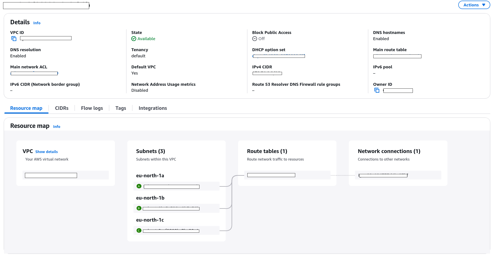
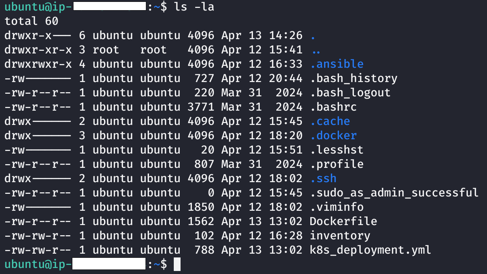

# Secure CI/CD pipeline for containerized Tetris Delivery on AWS

##### Project result:

<p align="center">
  
  
  
</p>

## 📚 Index:

- [Setting up servers](#setting-up-servers)
  - [SG & IAM Roles](#sg--iam-roles)
  - [Jenkins server](#jenkins-server)
    - [Jenkins installation and configuration](#jenkins-installation-and-configuration)
    - [Setting persistence on Jenkins](#setting-persistence-on-jenkins)
    - [SSH Communication Jenkins - Ansible server](#ssh-communication-jenkins---ansible-server)
    - [SSH Communication Jenkins - K8s server](#ssh-communication-jenkins---k8s-server)
  - [Ansible server](#ansible-server)
    - [Ansible installation and configuration](#ansible-installation-and-configuration)
    - [Docker installation](#docker-installation)
    - [SSH Communication Ansible - K8s server](#ssh-communication-ansible---k8s-server)
  - [K8s server](#k8s-server)
    - [Kubeadm installation and configuration](#kubeadm-installation-and-configuration)
    - [Enable Load Balancer](#enable-load-balancer)
    - [AWS Cloud Controller Manager (CCM)](#aws-cloud-controller-manager-ccm)
      - [Kube-controller-manager](#kube-controller-manager)
    - [IAM Roles and SGs](#iam-roles-and-sgs)
- [CI/CD](#cicd)
  - [GitHub Webhooks](#github-webhooks)
  - [Jenkins-pipeline](#jenkins-pipeline)
    - [Sending content from Jenkins to Ansible](#sending-content-from-jenkins-to-ansible)
    - [Communication Ansible - DockerHub](#communication-ansible---dockerhub)
      - [Building](#building)
      - [Tagging](#tagging)
      - [Pushing to DockerHub](#pushing-to-dockerhub)
    - [Communication Jenkins - Ansible - K8s](#communication-jenkins---ansible---k8s)
  - [Trigger pipeline (CI/CD)](#trigger-pipeline-cicd)

# Setting up servers

## SG & IAM Roles

| Requirements         | Inbound Rules                                        | Description                         | Outbound Rules      | IAM Roles           |
|--------------------|--------------------------------------------------------| ------------------------|---------------------|----------------------|
| **Jenkins-server** | SSH + my IP                                              |  SSH connection from my IP to Jenkins-server | All traffic 0.0.0.0/0 | No                  |
|                    | HTTP 80 + my IP                         |           HTTP connection from my IP to Jenkins-server             |                     |                      |
|                    | SSH <ANSIBLE_INTERNAL_IP>                         |  SSH connection from Ansible to Jenkins-server                      |                     |                      |
|                    | SSH <K8s_INTERNAL_IP>                      |         SSH connection from K8s-server to Jenkins-server               |                     |                      |
|                    | SSH Github Webhook IPv4                                |   SSH connection from IPv4 GitHub Webhooks to Jenkins-server                    |                     |                      |
|                    | SSH Github Webhook IPv6                                |   SSH connection from IPv6 GitHub Webhooks to Jenkins-server                     |                     |                      |
| **Ansible-server** | SSH + my IP                                              |    SSH connection from my IP to Ansible-server | All traffic 0.0.0.0/0 | No                  |
|                    | SSH + <JENKINS_INTERNAL_IP>                         |         SSH connection from Jenkins to Ansible-server |                     |                      |
|                    | SSH + <K8s_INTERNAL_IP>                      |      SSH connection from K8s-server to Ansible-server                  |                     |                      |
| **Kubernetes-server** | SSH + my IP                                           |   SSH connection from my IP to K8s-server                     | All traffic 0.0.0.0/0 | K8s-EC2-ELB-Role    |
|                    | SSH + <JENKINS_INTERNAL_IP>                         |        SSH connection from Jenkins to K8s-server |                     |                      |
|                    | SSH + <ANSIBLE_INTERNAL_IP>                         |        SSH connection from Ansible to K8s-server |                     |                      |
|                    | HTTP 80 + my IP                                  |   HTTP connection from my IP to K8s-server                     |                     |                      |
|                    | Custom TCP 31123 + my IP                               |   TCP connection from my IP to K8s-server                     |                     |                      |
|                    | Custom TCP 31123 + subnet IPs                          |   TCP connection 3 subnets to K8s-server      |                     |                      |
|                    | Custom TCP 31123 + LB_SG                     |   TCP connection LB Security Group to K8s-server       |                     |                      |
| **Load Balancer**  | Custom TCP 80 + my IP                                    |    HTTP connection from my IP to CLB (Access site)                     | All traffic 0.0.0.0/0 | K8s-EC2-ELB-Role    |
|                    | Custom TCP 31123 + my IP                 |      TCP connection from my IP to CLB                  |                     |                      |

## Jenkins server

### Jenkins installation and configuration

Activate the `jenkins-server` EC2 instance.
Locate your `.pem` file and enable permissions: `chmod 400 <KEYPAIR_FILENAME>`
Connect to your instance: `ssh -i <KEYPAIR_FILENAME> ubuntu@ec2-<PUBLIC_IP>.eu-north-1.compute.amazonaws.com`


You are connected to your jenkins-server!
For Jenkins installation I used the following [tutorial post](https://www.digitalocean.com/community/tutorials/how-to-install-jenkins-on-ubuntu-20-04).

1. Activate root user: `sudo su`
2.  Add the Correct GPG Key: 
```
sudo mkdir -p /etc/apt/keyrings
curl -fsSL https://pkg.jenkins.io/debian-stable/jenkins.io-2023.key | sudo tee /etc/apt/keyrings/jenkins-keyring.asc > /dev/null
```
3. Add the Jenkins repository to the system's package sources list: `echo "deb [signed-by=/etc/apt/keyrings/jenkins-keyring.asc] https://pkg.jenkins.io/debian-stable binary/" | sudo tee /etc/apt/sources.list.d/jenkins.list > /dev/null`
4. Update and upgrade the package list: `apt update && apt upgrade`
5. Install Jenkins: `apt install jenkins`
6. Start Jenkins service: `systemctl start jenkins`
7. After installing Jenkins it is probable that it won't work. In my case it was due to missing java (`java --version`). To solve this issue, install Java too: `apt install -y openjdk-17-jdk`. Repeat step 6.
8. Check Jenkins service status*: `systemctl status jenkins`


*`systemctl` is a tool used to manage system services on Linux systems that use systemd. `systemd` is a service manager for Linux, used to boot the system and managing processes.

9. Check if the firewall is inactive: `ufw status`
10. Allow traffic on port 8080 through firewall: `ufw allow 8080`
11. Check if the firewall is inactive: `ufw status`
12. If firewall is inactive (Means all firewall rules were ignored, including the ufw allow 8080 rule), allow OpenSSH and enable it: `sudo ufw allow OpenSSH && ufw enable`


When previous command is run, the `ufw enable` command activated the firewall, making all previously added rules (including 8080) take effect.
13. Check if the firewall is inactive again: `ufw status`.
14. Get the initial Jenkins admin password: `cat /var/lib/jenkins/secrets/initialAdminPassword`


Once you get the password, access the browser, type `<PUBLIC_IP_JENKINS>:<PORT>` and introduce it.

<p>
  
</p>

1. Select `Install suggested plugins`.
2. Create first admin user.
3. Save your Jenkins instance configuration: `http://<PUBLIC_IP_JENKINS>:<PORT>/`

<p>
  
</p>

Search and install: Dashboard -> Manage Jenkins -> Plugins -> ssh agent

<p>
  
</p>

Restart Jenkins after installation is fulfilled.

<p>
  
</p>

Jenkins ready!

### Setting persistence on Jenkins

When you turn off your EC2 instance, you will loose access to your Jenkins pipeline, being too slow to be used. It will seem like there are some issues to troubleshoot with Network ACLs, Security groups, Firewalls... Nonetheless, if you followed the exact same process from this post, you have to enable a recurrent update of your last update. For that:

1. Run: `vim /opt/update-jenkins-url.sh` and copy the content of the file `update-jenkins-url.sh` in the repository. Save and exit.
2. Execute `chmod +x /opt/update-jenkins-url.sh`.
3. Run: `sudo vim /opt/startup-tasks.sh`
4. This file will be the main "startup-tasks" that will be executed each time the EC2 instance is started/rebooted. Add:
```
#!/bin/bash

/opt/update-jenkins-url.sh
# Any other script you may need
```
3. Run: `sudo chmod +x /opt/startup-tasks.sh`
4. Run: `sudo vim /etc/systemd/system/startup-tasks.service`
```
[Unit]
Description=Run all custom startup scripts after boot
# The service starts after the network is up
After=network.target

[Service]
# Oneshot: Run the service once and then exit (don't stay active)
Type=oneshot

ExecStart=/opt/startup-tasks.sh

[Install]
# Run automatically while booting
WantedBy=multi-user.target
```
5. Activate the service again: `sudo systemctl daemon-reload && sudo systemctl enable startup-tasks.service`

### SSH communication Jenkins - Ansible server

###### Access the Jenkins Server

1. Run: `ssh-keygen -t rsa -b 4096 -C "jenkins-to-ansible"` and move your files to: `~/.ssh/`.
2. Activate permissions: `chmod 600 ~/.ssh/jenkins-to-ansible && chmod 644 ~/.ssh/jenkins-to-ansible.pub`
3. Show the content of the public key from Jenkins: `cat ~/.ssh/jenkins-to-ansible.pub`
4. Copy and paste it in the Ansible-server. Open the file: `vim ~/.ssh/authorized_keys` and paste the content of `jenkins-to-ansible.pub` there.
5. Restart the ssh2 service in the Ansible: `sudo systemctl restart ssh`
6. Go to Jenkins-server. Test the ping connection (the Inbound Rule must have been enabled before, ICMP IPv4 Jenkins <-> Ansible)
7. Access the Ansible-server executing from Jenkins-server: `ssh -i ~/.ssh/jenkins-to-ansible ubuntu@<ANSIBLE_internal_IP>`
8. Bingo. You must have entered the Ansible-server from Jenkins!

### SSH communication Jenkins - K8s server

###### Access the Jenkins Server

1. Run: `ssh-keygen -t rsa -b 4096 -C "jenkins-to-K8s"` and move your files to: `~/.ssh/`.
2. Activate permissions: `chmod 600 ~/.ssh/jenkins-to-K8s && chmod 644 ~/.ssh/jenkins-to-K8s.pub`
3. Show the content of the public key from Jenkins: `cat ~/.ssh/jenkins-to-K8s.pub`
4. Copy and paste it in the K8s-server. Open the file: `vim ~/.ssh/authorized_keys` and paste the content of `jenkins-to-K8s.pub` there.
5. Restart the ssh2 service in the K8s: `sudo systemctl restart ssh`
6. Go to Jenkins-server. Test the ping connection (the Inbound Rule must have been enabled before, ICMP IPv4 Jenkins <-> K8s)
7. Access the K8s-server executing from Jenkins-server: `ssh -i ~/.ssh/jenkins-to-K8s ubuntu@<K8s_internal_IP>`
8. Bingo. You must have entered the K8s-server from Jenkins!

**Jenkins-server configuration finished.**

## Ansible server

Ansible is an open-source automation tool used for configuration management, application deployment, and infrastructure orchestration. It allows managing servers and deployments using YAML-based playbooks. In this example, it will execute tasks on a remote server (the Kubernetes node). Instead of manually logging into the Kubernetes server and running kubectl apply or configurations, Ansible automates this process from a central control node (the "Ansible server"). This is typical in environments where infrastructure as code (IaC) and centralized management are required.

### Ansible installation and configuration

For Ansible installation I used the following [tutorial post](https://www.digitalocean.com/community/tutorials/how-to-install-and-configure-ansible-on-ubuntu-20-04).
1. Activate root user: `sudo su`
2. Add the Ansible PPA repository: `apt-add-repository ppa:ansible/ansible`
3. Update package lists to include the new repository and upgrade: `apt update && apt upgrade -y`
4. Install Ansible: `apt install ansible -y`

### Docker installation

Docker is an open-source containerization platform that allows developers to package applications and their dependencies into lightweight, portable containers. For Docker installation I used the following [tutorial post](https://www.digitalocean.com/community/tutorials/how-to-install-and-use-docker-on-ubuntu-20-04). We will use Docker in Ansible server for: Building Docker image + tagging + pushing image to DockerHub. Then K8s server will download this image from DockerHub and Deploy the game.

3. Install required dependencies for Docker: `apt install apt-transport-https ca-certificates curl software-properties-common -y`
4. Add the Docker GPG key to verify package authenticity: `curl -fsSL https://download.docker.com/linux/ubuntu/gpg | sudo apt-key add -`

      i. `-fsSL` : Ensures a silent, fail-safe, and secure download.

      ii. `apt-key add -` : Adds the downloaded GPG key to verify Docker packages.

5. Add the official Docker repository to APT sources: `add-apt-repository "deb [arch=amd64] https://download.docker.com/linux/ubuntu focal stable"`
6. Check available Docker versions and repository priority: `apt-cache policy docker-ce`
7. Install Docker CE (Community Edition): `apt install docker-ce -y`
8. Exit root mode and add your user to the docker group: `sudo usermod -aG docker $USER`
9. Check Docker service status: `systemctl status docker`


### SSH communication Ansible - K8s server

#### Access the Ansible Server

1. Run: `ssh-keygen -t rsa -b 4096 -C "ansible-to-k8s"` and move your files to: `~/.ssh/`.
2. Activate permissions: `chmod 600 ~/.ssh/ansible-to-k8s && chmod 644 ~/.ssh/ansible-to-k8s.pub`
3. Show the content of the public key from Ansible: `cat ~/.ssh/ansible-to-k8s.pub`
4. Copy and paste it in the K8s server. Open the file: `vim ~/.ssh/authorized_keys` and paste the content of `ansible-to-k8s.pub` there.
5. Restart the ssh2 service in the K8s-server: `sudo systemctl restart ssh`
6. Go to Ansible-server. Test the ping connection (the Inbound Rule must have been enabled before, ICMP IPv4 K8s <-> Ansible)
7. Access the K8s-server executing from Ansible-server: `ssh -i ~/.ssh/ansible-to-k8s ubuntu@<K8s_internal_IP>`
8. Bingo. You must have entered the K8s server from Ansible!

<p>
  
</p>

Now, exit your connection from K8s-server and from Ansible-server at `~` ($HOME) create the following file: `vim inventory`. Paste the following content:
```
[kubernetes_node]
<K8s_PRIVATE_IP> ansible_user=ubuntu ansible_ssh_private_key_file=~/.ssh/ansible-to-k8s
```

**Ansible-server configuration finished.**

## K8s server

Kubernetes (K8s) is an open-source container orchestration platform used for automating deployment, scaling, and management of containerized applications across multiple nodes. For this section we will install Docker and Kubectl.

### Kubeadm installation and configuration

1. Disable swap:
```
sudo swapoff -a
sudo sed -i '/ swap / s/^/#/' /etc/fstab
```
2. Update and install containerd
```
sudo apt update
sudo apt install -y containerd
```
3. Generate default config:
```
sudo mkdir -p /etc/containerd
containerd config default | sudo tee /etc/containerd/config.toml
```
4. Use systemd as group driver: `sudo sed -i 's/SystemdCgroup = false/SystemdCgroup = true/' /etc/containerd/config.toml`
5. Restart containerd:
```
sudo systemctl restart containerd
sudo systemctl enable containerd
sudo systemctl status containerd
```
6. Install Kubernetes tools (kubeadm, kubelet, kubectl):
```
sudo apt-get update && sudo apt-get install -y apt-transport-https curl
sudo curl -fsSL https://pkgs.k8s.io/core:/stable:/v1.29/deb/Release.key | sudo gpg --dearmor -o /etc/apt/trusted.gpg.d/kubernetes.gpg
echo 'deb https://pkgs.k8s.io/core:/stable:/v1.29/deb/ /' | sudo tee /etc/apt/sources.list.d/kubernetes.list

sudo apt-get update
sudo apt-get install -y kubelet kubeadm kubectl
sudo apt-mark hold kubelet kubeadm kubectl
```
7. Initialize Kubernetes cluster: `sudo kubeadm init --pod-network-cidr=10.244.0.0/16`. `10.244.0.0/16` is the default pod network range required by Flannel.
8. If an error is prompted related to missing kernel settings for kubernetes networking (`/proc/sys/net/bridge/bridge-nf-call-iptables` does not exist and `/proc/sys/net/ipv4/ip_forward` is not set to 1) run:
```
sudo modprobe br_netfilter
echo 'br_netfilter' | sudo tee /etc/modules-load.d/k8s.conf

echo 'net.bridge.bridge-nf-call-iptables=1' | sudo tee /etc/sysctl.d/k8s.conf
echo 'net.ipv4.ip_forward=1' | sudo tee -a /etc/sysctl.d/k8s.conf
sudo sysctl --system
```
This commands load the br_netfilter module and ensures it's loaded on boot, then sets required kernel params for Kubernetes networking. Rerun `sudo kubeadm init --pod-network-cidr=10.244.0.0/16`.
9. Set up kubectl access for your user:
```
mkdir -p $HOME/.kube
sudo cp -i /etc/kubernetes/admin.conf $HOME/.kube/config
sudo chown $(id -u):$(id -g) $HOME/.kube/config
```

### Enable Load Balancer

To expose the Tetris app (contained in a K8s Pod) through AWS, usually the easiest path is to set the Service with a LoadBalancer. This way K8s will create an ELB (Classic, NLB or ALB) and it will associate it to the nodes that run the service. An Elastic Load Balancer (ELB) is an AWS service that acts as public door entrance to your applications. It:

1. Receives internet traffic to the servers
2. Redirect traffic to the servers
3. Distributes the traffic between several instances/pods to avoid high traffic weight.

In our application, Kubernetes will ask AWS to create an Classic Load Balancer (CLB) automatically. This CLB will have a public DNS to access from the browser. To enable a CLB go where the `Service.yml` file is located.

For an self-organized K8s EC2 instance being able to create and administrate AWS resources (e.g., LB, EBS volumns, etc) there are two requirements:

 2. `kube-controller-manager` (control plane) must have `cloud-provider` set to `external`.
 3. Install external cloud provider (AWS Cloud Controller Manager, CCM)
 4. The EC2 instance that runs the control plane must have an IAM role with certain permissions.

This way, when K8s (`kube-controller-manager`) calls the AWS API (to create the LB), it will use the IAM role assigned.

2. Verify status: `sudo systemctl status containerd`

### AWS Cloud Controller Manager (CCM)

When deploying AWS Cloud Controller Manager (CCM) as a DaemonSet in the cluster, it will be responsible for creating Load Balancers, managing nodes, etc. The aws-cloud-controller-manager Pod is the one that uses the credentials of the instance's IAM Role and manages everything. After initializing kubeadm:


2. Install (CNI) network plugin (Flannel). Without CNI the Pods of CoreDNS and other components can't initiate: `kubectl apply -f https://raw.githubusercontent.com/flannel-io/flannel/master/Documentation/kube-flannel.yml`
3. Install Helm: `sudo snap install helm --classic`
5. Install AWS CCM:

```
helm repo add aws-cloud-controller-manager https://kubernetes.github.io/cloud-provider-aws
helm repo update
helm install aws-ccm aws-cloud-controller-manager/aws-cloud-controller-manager
```

#### kube-controller-manager

1. Execute: `sudo vim /etc/kubernetes/manifests/kube-controller-manager.yaml`
2. Add the following lines `- --cloud-provider=external` and `- --cluster-name=mycluster` to the section: `spec.containers.command:`

1. Verify that the aws-cloud-controller-manager Pod is running on kube-system: `kubectl get pods -n kube-system`
2. You should get back something like `aws-cloud-controller-manager-xxxxx`. Check its logs: `kubectl logs -n kube-system aws-cloud-controller-manager-xxxxx`.


4. Verify whether the Pod is hung for other motive: `kubectl describe pod -n kube-system aws-cloud-controller-manager-xxxxx`
5. Execute: `kubectl get pods -n kube-system`.

If you get back one Pod categorized as `CrashLoopBackOff` it means that the container is being recursively initialized due to an internal error. This error usually is that the AWS CCM can't access to the AWS API (lacks of IAM Role). For a single-node cluster (control plane + worker on the same instance), Flannel must be allowed (and any essential DaemonSets) to run on the same node. Remove the taint: `kubectl taint nodes --all node-role.kubernetes.io/control-plane:NoSchedule-` With this, Flannel will programm on the control-plane node and will create `/run/flannel/subnet.env` for the network to work (`kubernetes.io/cluster/<CLUSTER_NAME>=owned`).

Second step,  add `tags` to your AWS resources (VPC, subnets, instances, etc). The CCM will see this tag and recognize the nodes/permissions that belong to that cluster. If you want your <CLUSTER_NAME> to be `mycluster`, find the tags for each AWS resource you created and add the following values in EC2 instances -> Select instance -> Tags -> Add:
```
Key = kubernetes.io/cluster/mycluster
Value = owned
```
Do the same for VPC -> Subnets -> Select subnet -> Add. If the LB must have public IP the subnet must be public as well. To make it public the subnet must have an Internet Gateway associated to the route. Go to `Route tables`, add `0.0.0.0/0` with target `<Internet_Gateway>`. To find the internet gateway go to VPC dashboard -> Virtual Private Cloud -> Internet gateways. Copy the internet gateway ID.
With this, Flannel will bring up the network in the master node (because it is a cluster of one node) and AWS CCM will find the “ClusterID”. This combination allows the CCM to identify which EC2/ELB resources are bound to the Kubernetes cluster.

Usually with default settings Kubernetes node is not able to get information from the AWS Instance Metadata Service (IMDS) when doing curl. Without that access to the metadata, the AWS Cloud Controller Manager cannot automatically discover the Region/Zone/AZ.
Go to AWS -> EC2 Instances -> Select instance -> Actions -> Modify instance metadata options (Make sure IMDS is enabled).

<p>
  
</p>

Wait a few minutes and run: `curl http://169.254.169.254/latest/meta-data/placement/availability-zone` it must return your Region AZ.

Open the daemonset `kubectl edit ds aws-cloud-controller-manager -n kube-system` and in `spec.template.spec.containers.args:` add: `- --controllers=*,-route`. With the route controller disabled, K8s will not attempt to configure routes in the VPC.

Before moving to the next section:
1. Make sure the node and those subnets are in the same region.
2. Check the routing table of each subnet (must have internet gateway).
3. Add as inbound rule subnet IPs into the K8s server. For that: AWS -> EC2 (your instance) -> Copy VPC-ID -> VPC Dashboard -> Paste your VPC-ID and select it -> In resource map you will see the three subnets



Select one subnet and copy the IPv4 CIDR block (That is the subnet IP). Add as port (<LB_NODEPORT>) `31123` which is defined by `nodePort: 31123` in `Service.yml`). Do the same for each subnet.

### IAM Roles and SGs

#### IAM Role

Now, go through your AWS website. Access:

AWS -> EC2 (kubernetes-server) -> Security Groups:
Allow inbound rule: Type (HTTP), Port (80), Source (Your IP/Anywhere)

The EC2 instance that uses kubernetes must be asociated with an IAM rol with permissions to: Create, modify, eliminate LBs, obtain subnets and security groups information and associate an LB to the instances. To add these permissions:

IAM console in AWS -> Policies -> Create Policy -> Select JSON and paste the content from permissions.json -> Policy name: K8sELBAccessPolicy -> Create Policy.

Now access IAM console in AWS -> Roles -> Create (Trusted entity type: AWS Service, Service or Use case: EC2) -> Select your K8's policy:


Set as role name: K8s-EC2-ELB-Role -> Create Role.
Go to EC2 instances -> Select kubernetes-server -> Actions -> Security -> Modify IAM rol -> Assign the role created with `permission.json`. -> Reboot the instance.

This way, when K8s (`kube-controller-manager`) makes calls to the AWS API to create the ELB, it will automatically use the credentials of that IAM Role attached to the instance.

#### SGs

After setting the Security Groups table at the beginning, for AWS to be able to assign an instance ID to the LB a patch in `spec.providerID` 
route from the node is required. Run:

```
INSTANCE_ID=$(curl -s http://169.254.169.254/latest/meta-data/instance-id)
AZ=$(curl -s http://169.254.169.254/latest/meta-data/placement/availability-zone)
NODE_NAME=$(kubectl get nodes -o jsonpath='{.items[0].metadata.name}')
```
Return the variables manually with echo and introduce them in the following command (calling the variables won't work):
```
kubectl patch node $NODE_NAME \
  -p '{"spec":{"providerID":"aws:///$AZ/$INSTANCE_ID"}}'
```
This way K8s will know which EC2 instance corresponds to the node and will register to it the LB. Execute: `kubectl describe node $NODE_NAME | grep ProviderID`. A return as follows is expected: `ProviderID:  aws:///<AZ_REGION>/<INSTANCE_ID>`.

Access to the file: `sudo vim /var/lib/kubelet/kubeadm-flags.env` and substitute the current line for:
```
KUBELET_KUBEADM_ARGS="--container-runtime-endpoint=unix:///var/run/containerd/containerd.sock --pod-infra-container-image=registry.k8s.io/pause:3.9 --cloud-provider=external"
```
Restart kubelet:
```
sudo systemctl daemon-reexec
sudo systemctl restart kubelet
```
**K8s server configuration finished.**

# CI/CD

## Github Webhooks

GitHub Webhooks are automated HTTP callbacks that notify an external service (e.g. Jenkins, Slack, or a custom API) whenever specific events happen in a GitHub repository. It can be used to trigger CI/CD pipelines (our situation), send notifications or automate workflows.
To set it up, go to Jenkins Dashboard -> New Item (Name: jenkins-pipeline) -> For script introduce:

## Jenkins pipeline

```
node {
    stage('Git checkout'){
        git 'https://github.com/3v401/DevOps.git'
    }
}
```

Save.

Now access to Github repository (DevOps) -> Settings -> Webhooks -> Add new Webhook:

1. Payload URL: http://<JENKINS_PUBLIC_IP>:PORT/github-webhook/
2. Content type: application/json
3. Secret: To introduce the secret go to the jenkins-server and Dashboard -> Your user -> Security -> Add new token. Save the token and paste it into the Secret section.


4. Click on: Update webhook


Refresh the page after ping is sent. If it doesn't work (error appears). Very likely it is because the Jenkins server doesn't allow inbound access from Github webhooks. For that:

Open new terminal and run: `curl -s https://api.github.com/meta | jq -r '.hooks[]'`


This way you will get the list of IP addresses from GitHub to allow inbound rules.


Go to Webhooks (the one with error) -> Edit -> Recent Deliveries -> Redelivery. You will get the ping correctly. Now set Global (unrestricted) credentials:

Access to: Dashboard -> Manage Jenkins -> Credentials -> System -> Global credentials (unrestricted) -> Add credentials

Kind: SSH Username with private key, Scope: Global, ID: ansible-access, Description: ansible-access, Username: <ANSIBLE_USERNAME> (`ubuntu` in this tutorial), Private Key: Enter directly (enter your private key from your ansible-key.pem file, i.e., the one to log into ansible-server EC2 instance).

### Sending content from Jenkins to Ansible

After establishing the connection, generate the following pipeline content:

```
node {
    stage('Git checkout'){
        git 'https://github.com/3v401/DevOps.git'
    }
    stage('Sending Jenkins content to Ansible server over ssh'){
        sshagent(['ansible-access']){
            sh 'ssh -o StrictHostKeyChecking=no <ANSIBLE_USERNAME>@<ANSIBLE_INTERNAL_IP> '
            sh 'scp /var/lib/jenkins/workspace/jenkins-pipeline/Tetris-Game/Ansible-server/* <ANSIBLE_USERNAME>@<ANSIBLE_INTERNAL_IP>:/home/<ANSIBLE_USERNAME> '
        }
    }
}
```

Click on apply, save and click on `build now`. Wait until you get feedback. You will get the following outcome:


Jenkins prompts that the content has been sent correctly from Jenkins to Ansible. To check everything is setup, let's access the ansible terminal and verify its content:

<p>
  
</p>

As expected, the content is also located in the Ansible server.


### Communication Ansible - DockerHub

#### Building

In the Jenkins pipeline add the following snippet:

```
    stage('Docker build image'){
        sshagent(['ansible-access']){
            sh 'ssh -o StrictHostKeyChecking=no ubuntu@<ANSIBLE_INTERNAL_IP> cd /home/ubuntu/'
            sh 'ssh -o StrictHostKeyChecking=no ubuntu@<ANSIBLE_INTERNAL_IP> docker image build -t $JOB_NAME:v1.$BUILD_ID .'
        }
    }
```

3. After running this Jenkins snippet pipeline, in your Ansible-server run: `sudo docker image ls`

<p>
  
</p>

Congratulations, your Docker image has been built!

#### Tagging

Now let's tag it for later pushing it to the DockerHub. Add the following snippet to the previous jenkins-pipeline:

```
    stage('Docker image tagging'){
        sshagent(['ansible-access']){
            sh 'ssh -o StrictHostKeyChecking=no ubuntu@<ANSIBLE_INTERNAL_IP> cd /home/ubuntu/'
            sh 'ssh -o StrictHostKeyChecking=no ubuntu@<ANSIBLE_INTERNAL_IP> docker image tag $JOB_NAME:v1.$BUILD_ID dockerwhale123whaledocker/$JOB_NAME:v1.$BUILD_ID '
            sh 'ssh -o StrictHostKeyChecking=no ubuntu@<ANSIBLE_INTERNAL_IP> docker image tag $JOB_NAME:v1.$BUILD_ID dockerwhale123whaledocker/$JOB_NAME:latest '
        }
    }
```

Run the pipeline, you will get the following outcomes in the jenkins-pipeline and Ansible server:


#### Pushing to DockerHub

Access: Dashboard -> Manage Jenkins -> Credentials -> System -> Global credentials (unrestricted)

New credentials. Kind (Secret text), Scope (Global), Secret (your DockerHub password), ID (`dockerhub_pass`), Description (`dockerhub_pass`), Create.

Access: Dashboard -> Manage Jenkins -> Credentials -> System -> Global credentials (unrestricted).

Sample Step (withCredentials: Bind credentials to variables), Variable (`dockerhub_pass`), Credentials (`dockerhub_pass`).

Add the following snippet to the previous jenkins-pipeline:

```
    stage('Push Docker image to DockerHub'){
        sshagent(['ansible-access']){
            withCredentials([string(credentialsId: 'dockerhub_pass', variable: 'dockerhub_pass')]) {
                    sh 'ssh -o StrictHostKeyChecking=no ubuntu@<ANSIBLE_INTERNAL_IP> docker login -u <DOCKERHUB_USERNAME> -p ${dockerhub_pass} '
                    sh 'ssh -o StrictHostKeyChecking=no ubuntu@<ANSIBLE_INTERNAL_IP> docker image push <DOCKERHUB_USERNAME>/$JOB_NAME:v1.$BUILD_ID '
                    sh 'ssh -o StrictHostKeyChecking=no ubuntu@<ANSIBLE_INTERNAL_IP> docker image push <DOCKERHUB_USERNAME>/$JOB_NAME:latest '
            }
        }
    }
```

Apply and Save. Click 'Build Now'. You must get the following outcome into the jenkins-pipeline:


and into your DockerHub account:

<p>
  
</p>

Congratulations! You uploaded your Docker image into DockerHub via Jenkins and Ansible!

### Communication Jenkins - Ansible - K8s

Remember to allow inbound/outbound connections between Jenkins <-> Ansible <-> Kubernetes. Generate a pass key as we did in Ansible but for Kubernetes (K8s-access).

Acess: Dashboard -> Manage Jenkins -> Credentials -> System -> Global credentials (unrestricted) -> Add Credentials

Kind (SSH Username with private key), ID (K8s-access), Description (K8s-access), Username (<KUBERNETES_USERNAME>), Private Key (Enter directly Key, your pem private key).

Add the following snippet to the jenkins-pipeline:

```
    stage('Copy files from Jenkins to Kubernetes server'){
        sshagent(['K8s-access']){
            sh 'ssh -o StrictHostKeyChecking=no ubuntu@<K8s_INTERNAL_IP> '
            sh 'scp /var/lib/jenkins/workspace/jenkins-pipeline/Tetris-Game/Kubernetes-server/* ubuntu@<K8s_INTERNAL_IP>:/home/ubuntu/ '
        }
    }
    stage('Kubernetes Deployment using Ansible') {
        sshagent(['ansible-access']) {
            sh '''
                ssh -o StrictHostKeyChecking=no ubuntu@<ANSIBLE_INTERNAL_IP> "
                    cd /home/ubuntu && sudo ansible-playbook -i inventory k8s_deployment.yml
                "
            '''
        }
    }
```

`ansible-playbook -i inventory k8s_deployment.yml`: Runs the k8s_deployment.yml playbook that contains tasks to deploy and configure resources on the Kubernetes server. The target is registered in the `inventory` folder.

## Trigger pipeline (CI/CD)

Now the complete pipeline for Jenkins is ready. To show the complete user-experience. Clone the whole github repository form this project. Access `Tetris-Game` folder. Create your own repository on GitHub and do:
`git push origin master`

Your CI/CD project would be triggered:

The successful Jenkins-pipeline should return as follows:


Access to the K8s-server and run:
```
kubectl get events
kubectl describe svc tetris-service
```
An event outcome will be similar to: `UnAvailableLoadBalancer: There are no available nodes for LoadBalancer`. This means that even though the ELB is created, no instances are registered as targets if the node (ip-XXXXX) has the role of control-plane, and by default, Kubernetes doesn't register control-plane nodes as LoadBalancer targets. Hence, not routing traffic properly, thus AWS CCM not being able to assign the instance to the CLB. It must be done manually (an alternative is using Terraform which will be used in a future project).

To see the external IP run: `kubectl get svc tetris-service`

Access the CLB -> Health Check Configuration -> Protocol: `TCP`, Port: `31123` <NODEPORT_LB>.
Access the CLB -> Target instances -> Add target instance (K8s server).

Wait one minute to see the `Health-status` in LB Target. You will see `in-service`. That means it is ready and passed the Health-check.


Grab the public (CLB) IP address from the command: `kubectl describe svc tetris-service`. Paste it into your browser and you will obtain the following outcome:

<p>
  
</p>

Congratulations! You settled your first Game pipeline on AWS! 🥳


