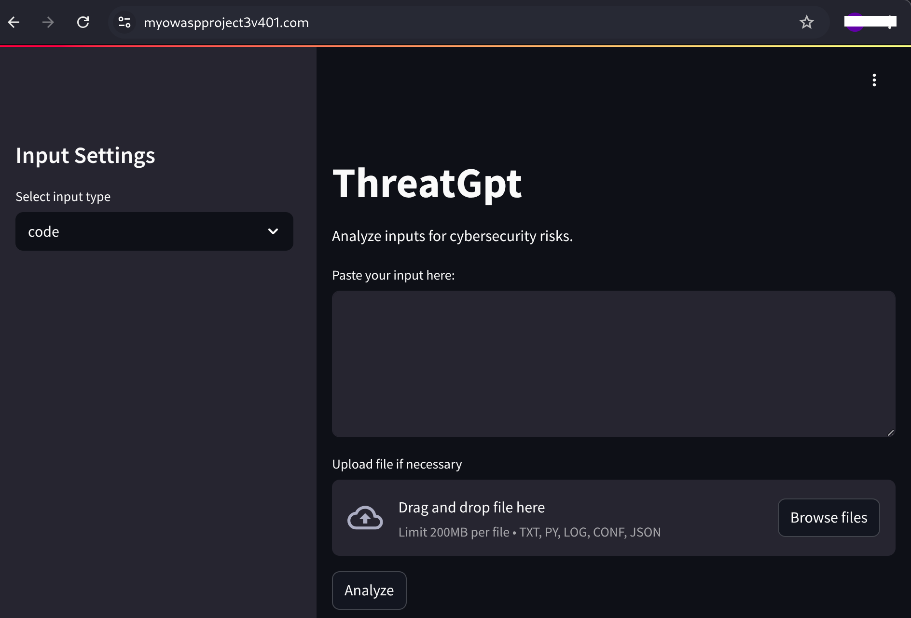

# 💥 ThreatGPT: Explain, Predict, and Patch API. 💥
(Post under development)

This project provides an AI-powered API that ingest suspicious logs, misconfigured IaC or risky code snippets and returns:

1. Human-readable explanation of the threat
2. Prediction of attacker's next move
3. Patch suggestion

ThreatGPT is an AI-powered DevSecOps pipeline integrating AWS, Cloudflare, Terraform, Prometheus,
Grafana, Jenkins, and Trivy to detect, analyze, and remediate security threats. It ingests logs, IaC, code
snippets, and files to identify risks, with CloudWatch providing real-time monitoring, custom metric alerts, and
automated email notifications for proactive incident response

#### Result

  

### Skills obtained:

1. `Software Development`: Design and implementation of an API using modular architecture and AI integration with OpenAI's SDK.
2. `Infrastructure as Code`: Terraform and Ansible modules for AWS
3. `Cloudflare`: DNS, DDoS protection, and Web Application Firewall (WAF)
4. `AWS in-depth knowledge`: EC2, S3, EBS, IAM, VPC, CloudWatch, and more.
5. `Access Control`: IAM and Security Groups defined following least-privilege principles
6. `Threat Monitoring`: OWASP threat patterns alert via email
7. `CI/CD` integration: Modular design via Jenkins pipelines for auto-patch and redeploy
8. `Containerization and Orchestration`: Deployment of the AI model via Dockerrization in a Kubernetes Cluster.

## Index

- **ThreatGPT API**
  - Design and Development

- **Terraform**
  - Infrastructure Architecture

- **Cloudflare**
  - Setting up domain
  - Setting up SSL certificate (HTTPS)
  - WAF/DDoS/OWASP Top 10 protection

- **Monitoring**
  - Prometheus
  - Grafana

- **Workflow Verification Checks**
  - SSH connections
  - Instances
  
- **ThreatGPT Tests**
  - Example 1: Insert vulnerable AWS configuration - AWS_S3_bucket_policy.json
  - Example 2: Insert malicious code snippet - remove_etcpasswd.py
  - Example 3: Insert malicious file - Ransomware.py
